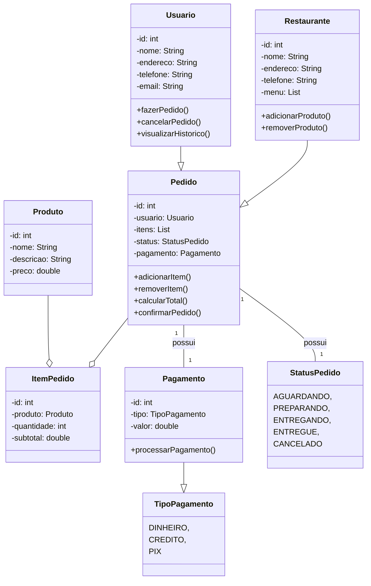

# restaurante-dev-api

A API de pedidos permite que os usuários interajam com restaurantes e produtos, façam pedidos, acompanhem o status de seus pedidos e acessem o histórico de pedidos anteriores. A API é composta por recursos relacionados a usuários, restaurantes, produtos e pedidos.

## Recursos Já Criados

### Usuários

- `POST /usuarios`: Cria um novo usuário com informações como nome, endereço, telefone e e-mail.
- `GET /usuarios/{id}`: Obtém informações sobre um usuário específico.
- `PUT /usuarios/{id}`: Atualiza informações de um usuário existente.
- `DELETE /usuarios/{id}`: Exclui um usuário.
---

## Recursos NÃO Criados

### Restaurantes

- `POST /restaurantes`: Cria um novo restaurante com informações como nome, endereço, telefone e menu de produtos.
- `GET /restaurantes/{id}`: Obtém informações sobre um restaurante específico.
- `PUT /restaurantes/{id}`: Atualiza informações de um restaurante existente.
- `DELETE /restaurantes/{id}`: Exclui um restaurante.

---

### Produtos

- `POST /restaurantes/{restauranteId}/produtos`: Adiciona um novo produto ao menu de um restaurante.
- `GET /restaurantes/{restauranteId}/produtos/{produtoId}`: Obtém informações sobre um produto específico em um restaurante.
- `PUT /restaurantes/{restauranteId}/produtos/{produtoId}`: Atualiza informações de um produto existente.
- `DELETE /restaurantes/{restauranteId}/produtos/{produtoId}`: Remove um produto do menu de um restaurante.

---

### Pedidos

- `POST /pedidos`: Cria um novo pedido com informações do usuário, restaurante e itens do pedido.
- `GET /pedidos/{id}`: Obtém informações sobre um pedido específico.
- `PUT /pedidos/{id}`: Atualiza o status de um pedido (confirmado, preparando, entregando, entregue ou cancelado).
- `DELETE /pedidos/{id}`: Cancela um pedido.

---

## Recursos Adicionais

- `GET /usuarios/{id}/historico-pedidos`: Obtém o histórico de pedidos de um usuário.

## Notas Adicionais

- Os pedidos podem ter diferentes status, como "Aguardando", "Preparando", "Entregando", "Entregue" e "Cancelado", representados pelo enum `StatusPedido`.

